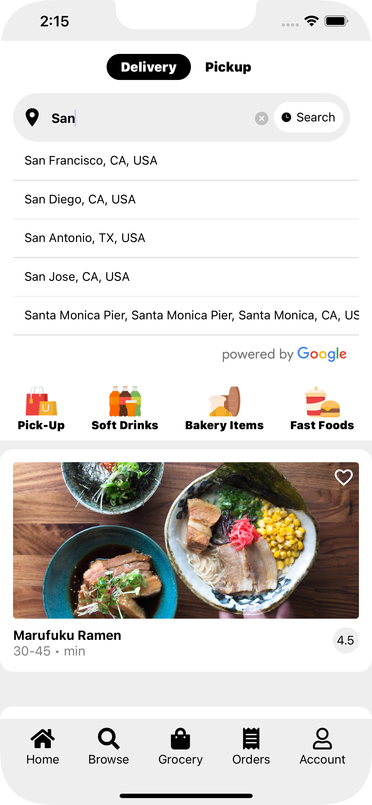
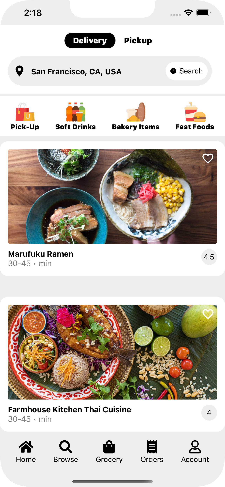
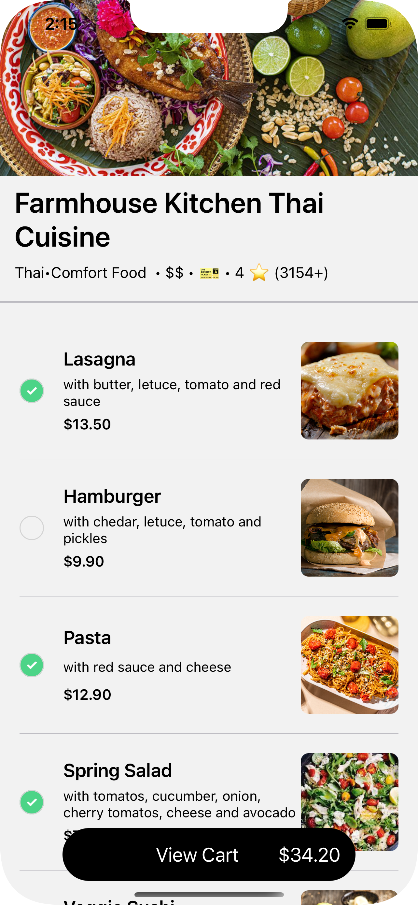
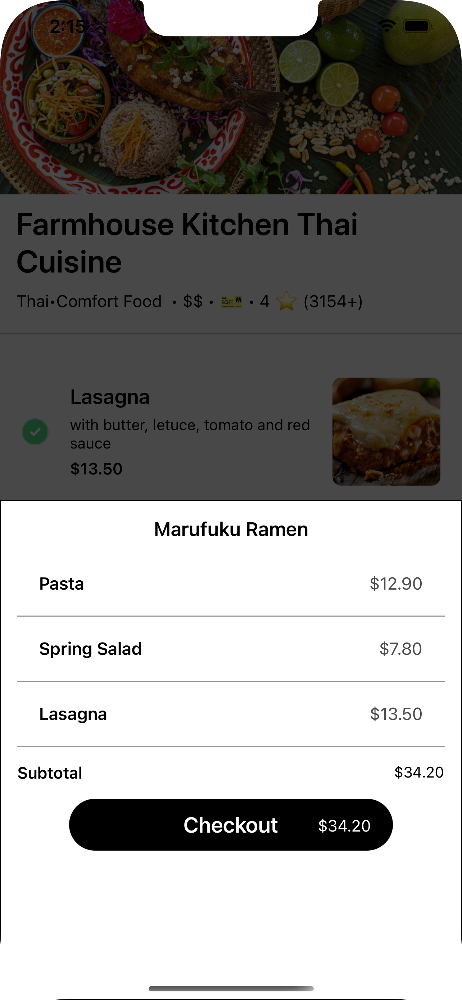
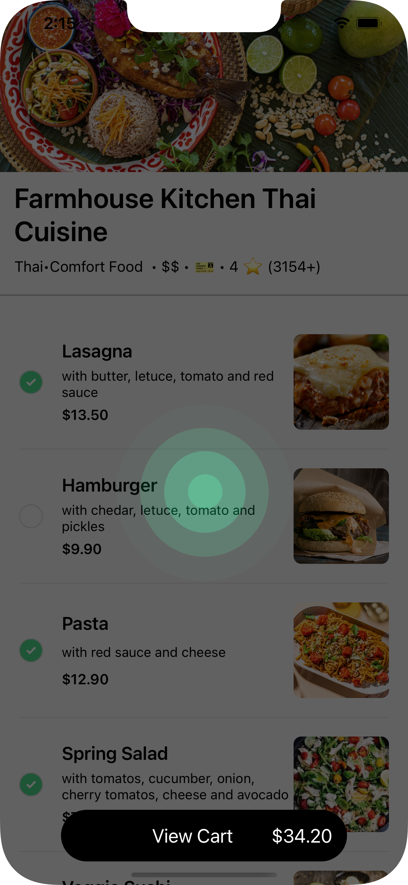
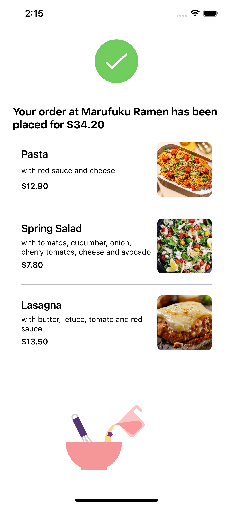

# Uber-Eats-Clone

This is a clone of the application Uber Eats.


### Technologies

- React Native
- Firebase
- Redux
- Google API
- YELP API

### How To Install

#### Clone the repository
```console
git clone https://github.com/guadacastro/UberEats-clone.git
``` 

#### Enter to the repository folder
```console
cd Uber-Eats-clone
```
#### Install Expo CLI
``` console
npm install -g expo-cli
```

#### Instal all dependencies
``` console
npm install
```

#### Run the IOS app
```console
npm run ios
```

#### Run the Android app
```console
npm run android
```


### This is what it looks like
<styles> 
    p {}
</styles>
<p float="left"  >






</p>

